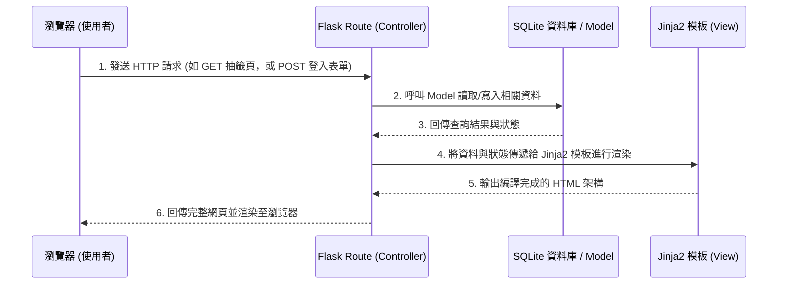

# 線上算命系統 - 系統架構文件 (Architecture)

## 1. 技術架構說明

本專案採用經典的伺服器渲染 (Server-Side Rendering, SSR) 模式，所有的業務邏輯、資料庫操作與畫面渲染皆集中於後端處理，以簡化開發與降低維護成本。

### 選用技術與原因
- **後端框架：Python + Flask**
  - **原因**：Flask 是輕量級且高彈性的網頁框架，適合快速建立原型與小型專案。它能輕鬆整合 SQLite，並且有大量的第三方套件支援。
- **模板引擎：Jinja2**
  - **原因**：Flask 內建的模板引擎，可以用於將後端處理好的資料動態渲染到 HTML 頁面上輸出。這省去了前端使用如 React/Vue 等框架需要處理 API 發送的額外工序。
- **資料庫：SQLite**
  - **原因**：開發環境中不需要額外安裝或伺服器，資料儲存在單一檔案 (`database.db`) 中，非常適合當前 MVP (Minimum Viable Product) 範圍的需求。

### Flask MVC 模式說明
雖然 Flask 本身是微框架，我們在此採用類似 MVC（Model-View-Controller）的分層設計來管理程式碼：
- **Model (模型)**：負責與 SQLite 資料庫互動，定義資料表結構（例如 User, Record 等）以及預編譯的 SQL 查詢邏輯。
- **View (視圖)**：負責呈現給使用者的畫面。這裡即是 Jinja2 引擎加上 HTML/CSS/JS 檔案（撰寫於 `templates/` 與 `static/`）。
- **Controller (控制器)**：由 Flask 的路由（Routes）擔任，接收使用者的 HTTP 請求、呼叫 Model 去讀寫資料庫，並將資料傳遞給 View 產生動態網頁。

---

## 2. 專案資料夾結構

採用標準的 Flask 專案模組化結構，以提高程式碼的可讀性與可維護性。

```text
online-fortune-telling/
├── app/                      ← 主要的應用程式模組
│   ├── __init__.py           ← 初始化 Flask App 或套件設定
│   ├── models/               ← 資料庫與資料操作邏輯 (Model)
│   │   ├── __init__.py
│   │   ├── user.py           ← 會員相關模型
│   │   └── record.py         ← 算命紀錄、籤詩相關模型
│   ├── routes/               ← 應用程式的路由控制器 (Controller)
│   │   ├── __init__.py
│   │   ├── auth.py           ← 處理註冊、登入邏輯
│   │   ├── fortune.py        ← 處理抽籤、占卜邏輯
│   │   ├── history.py        ← 處理歷史紀錄查詢邏輯
│   │   └── payment.py        ← 處理添香油錢邏輯
│   ├── templates/            ← Jinja2 HTML 模板 (View)
│   │   ├── base.html         ← 共用版型 (Header, Footer, Navbar)
│   │   ├── index.html        ← 首頁
│   │   ├── login.html        ← 登入/註冊頁面
│   │   ├── draw_lots.html    ← 抽籤互動頁面
│   │   ├── result.html       ← 籤詩結果與解籤頁面
│   │   └── history.html      ← 個人歷史紀錄頁面
│   └── static/               ← 靜態資源檔案
│       ├── css/
│       │   └── style.css     ← 自訂樣式檔案
│       ├── js/
│       │   └── main.js       ← 增加抽籤動畫或互動的腳本
│       └── images/           ← 籤筒、筊杯等圖檔資源
├── instance/                 ← 敏感與特定環境的檔案，不加入版控
│   └── database.db           ← SQLite 資料庫檔案
├── docs/                     ← 專案文件 (包含 PRD, ARCHITECTURE 等)
├── requirements.txt          ← Python 依賴套件列表 (Flask, etc.)
├── config.py                 ← 環境變數與全域設定 (秘鑰等)
└── app.py                    ← 專案入口點，負責啟動伺服器
```

---

## 3. 元件關係圖

以下表示使用者進行操作時，系統內各元件的處理流程：



---

## 4. 關鍵設計決策

1. **依功能拆分路由模組 (Flask Blueprints)**
   * **決策**：利用 Flask Blueprints 將單一的路由檔案 (`app.py`) 拆分成多個邏輯模組 (`auth`, `fortune`, `history` 等)。
   * **原因**：減少單個檔案的龐大複雜度，即使之後增加多種算命種類，程式碼也能清楚分類，方便團隊成員協作及未來的程式碼維護。

2. **內建 Session 機制儲存登入狀態**
   * **決策**：使用 Flask 內建基於 Cookie 的 Session，而非引入 JWT 機制。
   * **原因**：由於這是一個傳統的後端渲染多頁面網站，瀏覽器與 Session 配合最為自然，實作簡易且足夠安全（資料存在伺服器端，使用 SECRET_KEY 簽名防篡改）。

3. **抽籤邏輯實作於後端 (Server-Side)**
   * **決策**：隨機產生「抽到哪支籤」與「擲筊的結果」運算由 Python 後端執行。
   * **原因**：結果在後端產生後，可以第一時間無縫將數據存入 SQLite 作為使用者的歷史紀錄，然後再渲染至前端。這避免了如果在 JS 前端計算隨機數後，還要再寫一隻 API 將結果打回後端回存的不穩定性。

4. **輕量級前端實作**
   * **決策**：畫面動畫與互動完全採用原生 (Vanilla) CSS 及 JavaScript，不引入 Bootstrap 以外的複雜 UI 框架或 React/Vue。
   * **原因**：在以 Flask Jinja2 為核心的架構裡，維持輕量的前端程式碼以滿足「虛擬搖籤筒」之類的小互動即為最佳解，不增加多餘學習成本與編譯工序。
