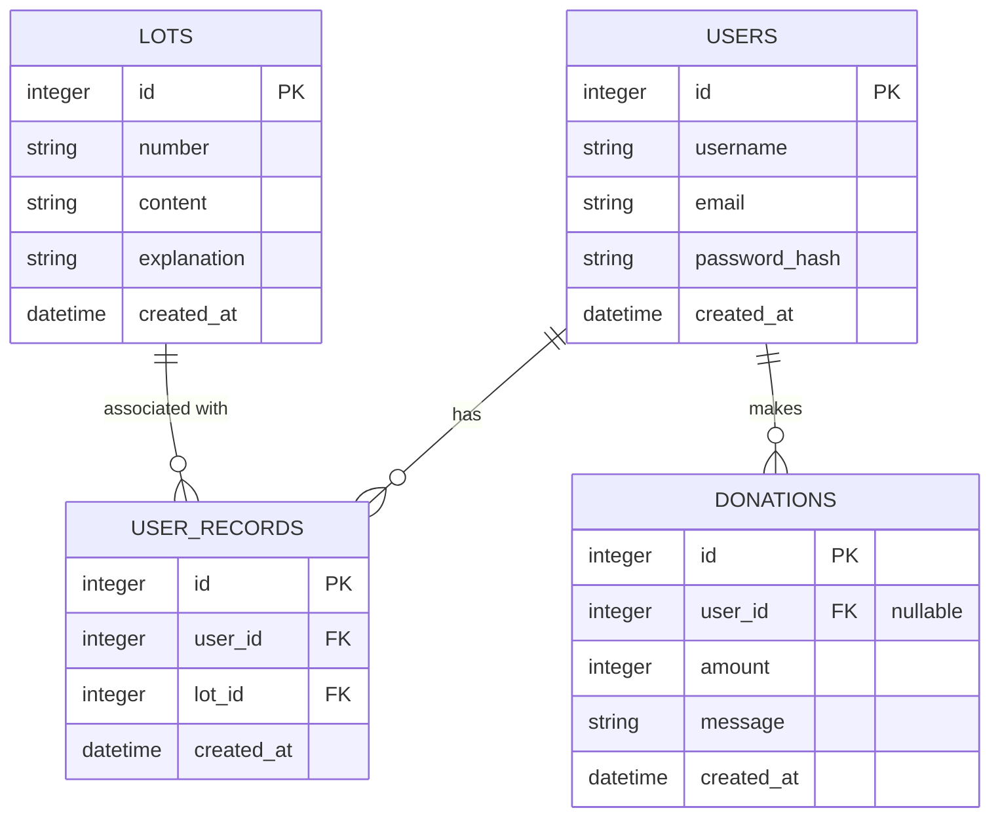

# DB Design Skill — 資料庫設計

## 1. ER 圖（實體關係圖）

## 2. 資料表詳細說明

### users (會員資料表)
儲存使用者的登入資訊與基本狀態。
- `id` (INTEGER PRIMARY KEY AUTOINCREMENT): 流水序號
- `username` (TEXT, Not Null): 使用者名稱
- `email` (TEXT, Not Null): 電子郵件 (可作帳號)
- `password_hash` (TEXT, Not Null): 加密後的密碼
- `created_at` (DATETIME, Not Null): 註冊時間

### lots (籤詩內容表)
系統內建的籤詩資料庫，包含籤詩內容與解說。
- `id` (INTEGER PRIMARY KEY AUTOINCREMENT): 籤詩編號
- `number` (TEXT, Not Null): 第幾籤 (例如: 第一籤、第六十籤)
- `content` (TEXT, Not Null): 籤詩內文
- `explanation` (TEXT, Not Null): 白話文解籤說明 (事業、感情、健康等)
- `created_at` (DATETIME, Not Null): 建立時間

### user_records (算命紀錄表)
儲存使用者每次抽籤的歷史紀錄。
- `id` (INTEGER PRIMARY KEY AUTOINCREMENT): 紀錄流水號
- `user_id` (INTEGER, Not Null): 關聯至 `users.id`
- `lot_id` (INTEGER, Not Null): 關聯至 `lots.id`
- `created_at` (DATETIME, Not Null): 抽籤時間

### donations (添香油錢表)
線上捐獻的紀錄。
- `id` (INTEGER PRIMARY KEY AUTOINCREMENT): 捐贈紀錄流水號
- `user_id` (INTEGER, Nullable): 如果有登入則關聯至 `users.id`，否則為 NULL
- `amount` (INTEGER, Not Null): 捐獻金額
- `message` (TEXT, Nullable): 捐獻心意或祈願訊息
- `created_at` (DATETIME, Not Null): 捐贈時間
