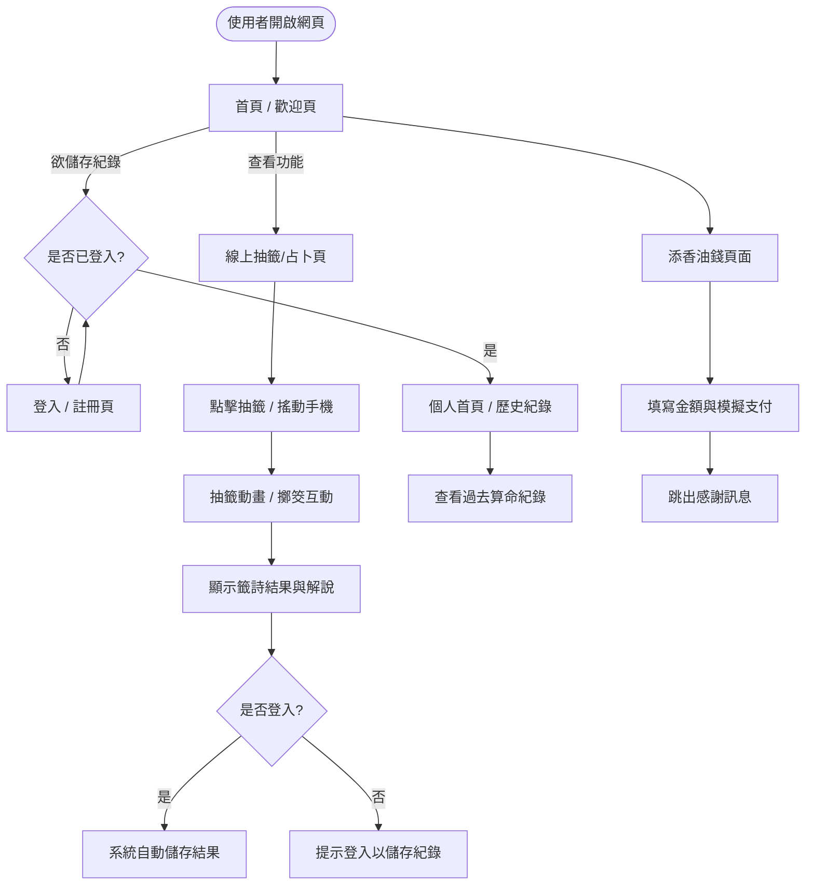
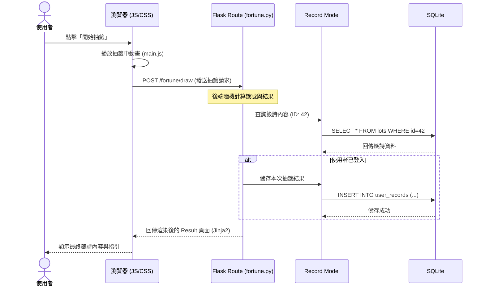

# 線上算命系統 - 流程圖文件 (Flowchart)

本文件描述了「線上算命系統」的使用者操作流程以及系統內部的資料處理流程。

## 1. 使用者流程圖 (User Flow)

下圖展示了使用者從進入網站到完成抽籤、查看紀錄及捐贈的操作路徑。

---

## 2. 系統序列圖 (Sequence Diagram)

以「使用者進行線上抽籤」為例，展示前端、後端路由、資料模型與資料庫之間的互動。

---

## 3. 功能清單對照表

以下為系統規劃的各項功能對應的 URL 路徑與 HTTP 方法：

| 功能名稱 | URL 路徑 | HTTP 方法 | 說明 |
| :--- | :--- | :--- | :--- |
| **首頁** | `/` | GET | 系統入口與功能導覽 |
| **註冊頁面** | `/auth/register` | GET / POST | 帳號創立 |
| **登入頁面** | `/auth/login` | GET / POST | 身分驗證 |
| **登出** | `/auth/logout` | POST | 清除 Session |
| **線上抽籤** | `/fortune/draw` | GET / POST | 執行抽籤演算法 |
| **查看紀錄** | `/history` | GET | 列出該使用者的所有算命歷史 |
| **紀錄詳情** | `/history/<id>` | GET | 查看特定一筆算命的詳細內容 |
| **添香油錢** | `/payment/donate` | GET / POST | 模擬捐贈功能 |

---

## 4. 流程說明

1.  **抽籤邏輯**：為了確保公平性與未來的可擴充性，抽籤的核心亂數邏輯是在 Flask 後端處理。前端主要負責提供視覺上的回饋（如 CSS 動畫）。
2.  **身分驗證**：只有登入的使用者能將結果持久化儲存在 `user_records` 資料表中。非登入使用者僅能單次查看結果，重新整理頁面後資訊將遺失。
3.  **重導向機制**：在登入或註冊成功後，系統會自動將使用者導回原本所在的頁面，確保操作體驗不中斷。
